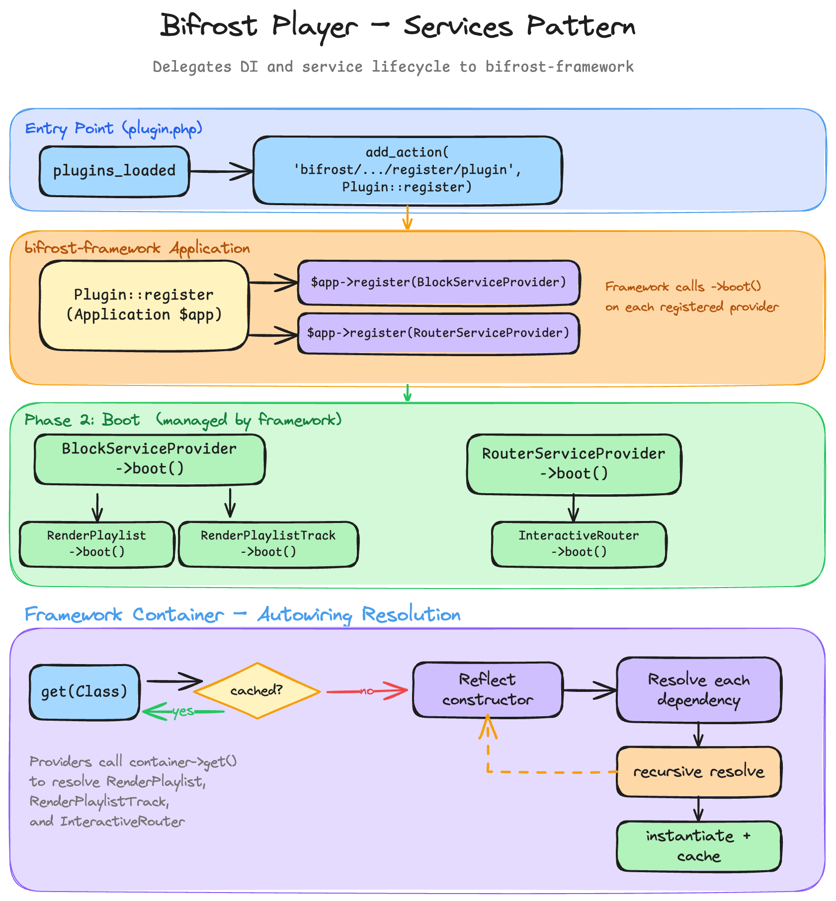

# Bifrost Player

A persistent audio player for the Developer Showcase. Music keeps playing as users navigate between pages using the WordPress Interactivity Router for SPA-like client-side navigation.


## Architecture

### Plugin lifecycle

```
bifrost-framework (plugins_loaded @ 999)
  → do_action('bifrost/framework/register/plugin', $app)
    → Plugin::register($app)
      → registers BlockServiceProvider
      → registers RouterServiceProvider
  → $app->boot()
    → boots all providers that implement Bootable
```



[See diagram on Excalidraw](https://excalidraw.com/#json=Fe_KgC1pYL6HhLlTetBc4,UV7E_u_8MX0dPxMY-4G48g)


The plugin uses **bifrost-framework** for its service container and provider lifecycle (same as `bifrost-music`). The `Plugin` class registers two providers into the framework's shared `Application`:

| Provider | Responsibility |
|---|---|
| `BlockServiceProvider` | Registers blocks, renders the player in `wp_footer`, boots playlist bridge filters |
| `RouterServiceProvider` | Boots `InteractiveRouter` for client-side navigation |

### Blocks

#### `audio-player` — Persistent player bar

- **Rendered in `wp_footer`** by `BlockServiceProvider` (not placed in templates).
- Hidden by default; becomes visible when `state.currentTrackUrl` is set.
- Contains artwork, track info, play/pause, close button, and a `<audio>` element.
- All UI bound reactively via `data-wp-*` directives to the `bifrost-player` store.

#### `play-button` — "Listen Now" button

- Server-rendered with automatic track resolution: falls back to the current post's first audio attachment, parent album artist, and featured image.
- Sets Interactivity API context (`trackUrl`, `trackTitle`, `trackArtist`, `trackImage`) and triggers `actions.playTrack` on click.
- Uses standard `wp-block-button` markup for theme style inheritance.

### Interactivity store (`view.js`)

A single `bifrost-player` store manages all state and actions:

```
state
├── currentTrackUrl / Title / Artist / Image
├── isAudioPlaying
├── isPlayerVisible  (derived: trackUrl !== '')
└── playPauseLabel   (derived: ⏸ / ▶)

actions
├── playTrack()       — reads context, sets track state, starts playback
├── togglePlay()      — toggles isAudioPlaying
├── closePlayer()     — stops playback, clears track
├── onTrackEnded()    — resets playing state
├── navigate()        — client-side navigation via interactivity-router
└── prefetch()        — prefetches link on hover

callbacks
├── syncPlayback()           — watches state, controls <audio> play/pause
└── initPlaylistBridge()     — bridges core/playlist waveform events
```

### Client-side navigation

`InteractiveRouter` enables SPA-like page transitions so the player (rendered in `wp_footer`, outside all regions) persists across navigations.

**How it works:**

1. A `render_block` filter wraps `<main>`, `<header>`, and `<footer>` in **router regions** (`data-wp-router-region`). Only content inside these regions is swapped during navigation.
2. Every `<a>` tag inside router regions gets `data-wp-on--click="actions.navigate"` and `data-wp-on--mouseenter="actions.prefetch"` injected via `WP_HTML_Tag_Processor`.
3. The `navigate` action dynamically imports `@wordpress/interactivity-router` and delegates to its `actions.navigate()`.

**Workarounds in place:**

- The audio-player's `viewScriptModule` is enqueued early via `wp_enqueue_scripts` to ensure its dynamic dependencies are in the import map before it's printed (blocks in `wp_footer` would otherwise miss the import map window).
- Script modules like `@wordpress/block-library/tabs/view` are explicitly marked for client navigation via `add_client_navigation_support_to_script_module()`, working around a missing `build/modules/index.php` in the current Gutenberg build.

### `core/playlist` integration

The `core/playlist` block uses a locked store, so direct cross-store action calls are not possible. Integration works through event bridging:

```
core/playlist (waveform player)
  → dispatches 'waveformplayer:play' event
    → RenderPlaylist injects data-wp-init="bifrost-player::callbacks.initPlaylistBridge"
      on the playlist <figure>
    → initPlaylistBridge() listens for the event, pauses the waveform audio,
      and transfers playback data to the bifrost-player store
```

`RenderPlaylistTrack` adds `data-wp-context` and `data-wp-on--click="actions.playTrack"` to each `core/playlist-track`, enabling direct track selection.

### File structure

```
bifrost-player/
├── plugin.php                          # Entry point, constants, framework hook
├── inc/
│   ├── Plugin.php                      # Static registrar (registers providers with framework)
│   ├── Block/
│   │   ├── BlockServiceProvider.php    # Registers blocks, renders player in footer
│   │   ├── RenderPlaylist.php          # Injects bridge init on core/playlist
│   │   └── RenderPlaylistTrack.php     # Injects context + click on playlist tracks
│   └── Router/
│       ├── RouterServiceProvider.php   # Boots InteractiveRouter
│       └── InteractiveRouter.php       # Router regions + link directives
└── src/blocks/
    ├── audio-player/
    │   ├── block.json                  # Block metadata
    │   ├── index.js                    # Editor entry (imports style.css)
    │   ├── render.php                  # Server render + initial iAPI state
    │   ├── style.css                   # Player bar styles
    │   └── view.js                     # Interactivity store (state, actions, callbacks)
    └── play-button/
        ├── block.json                  # Block metadata + attributes
        └── render.php                  # Server render with track resolution
```

Container, Application, ServiceProvider, and Bootable are provided by `bifrost-framework` — no local copies.

### Data flow

```
User clicks play-button
  → actions.playTrack() reads context → sets state.currentTrack* + isAudioPlaying
    → audio-player becomes visible (isPlayerVisible derived)
    → callbacks.syncPlayback() calls audio.play()

User clicks link
  → actions.navigate() prevents default → imports interactivity-router
    → router swaps <main>, <header>, <footer> regions
    → audio-player in wp_footer is outside regions → stays mounted, keeps playing

User clicks track in core/playlist
  → waveformplayer:play event fires on <figure>
    → initPlaylistBridge() pauses waveform audio
    → transfers track data to bifrost-player state → persistent player takes over
```